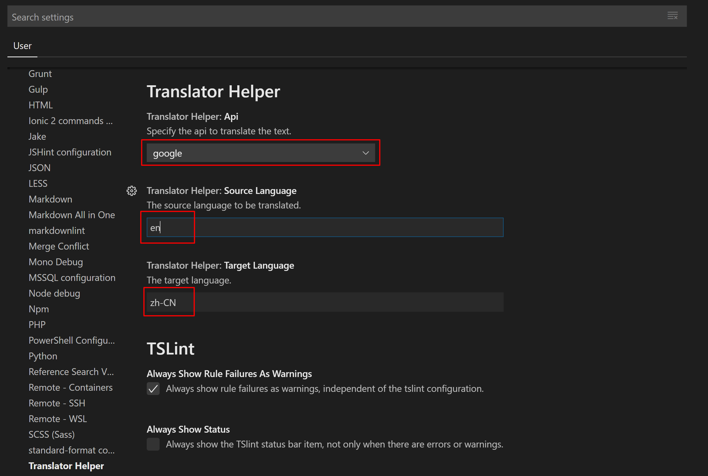

# translator-helper README

**translator-helper** is a VS Code Extension to simplify the translation of documents, especially for the localization of Docs.

## Features

Google translate API supported. For Chinese users, you can update the settings to use GoogleCN service.

* Translate: <kbd>Ctrl</kbd>+<kbd>T</kbd>. Select a word or a sentence, then press Ctrl+T. The translated text will be shown on the status bar. Click the text, it will be copied to the clipboard.

* Translate and Insert. <kbd>Alt</kbd>+<kbd>T</kbd>. It is very useful when you localize the docs. Click any position in the paragraph, then press Alt+T. The whole paragraph will be translated then inserted after the original text.

* Reverse Translate and Insert: <kbd>Shift</kbd>+<kbd>Alt</kbd>+<kbd>T</kbd>. Translate the text from the *target* language to the *source* language.

## Extension Settings

You can change the User Settings to specify the API and the languages you need to translate.

This extension contributes the following settings:

* `translatorHelper.api`: Specify the translate API. Options: `google`, `google-cn`.
* `translatorHelper.sourceLanguage`: The source language code. The default value is `en`.
* `translatorHelper.targetLanguage`: The target language code. The default value is `zh-CN`.

The source and target languages are identified using the [iso-639-1](https://en.wikipedia.org/wiki/List_of_ISO_639-1_codes) codes. For example, the source language is English (en) and the target language is Chinese-Simplified (zh-CN). You can find all the supported languages here: [Language support](https://cloud.google.com/translate/docs/languages)

## Known Issues

The keybinding might not work properly on some linux machines. Please open issues to describe your environment. Thanks.

## Release Notes

### 0.1.0

Add reverse translation.

### 0.0.3

Initial release.

-----------------------------------------------------------------------------------------------------------

### For more information

* [GitHub Repository](https://github.com/yanxiaodi/vscode-translator-helper)

**Enjoy!**
